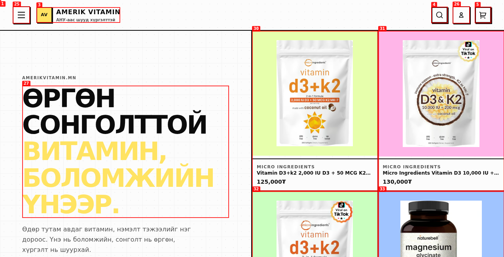

# Dogfood Report: amerikvitamin.mn

| Field | Value |
|-------|-------|
| **Date** | 2026-06-28 |
| **App URL** | https://amerikvitamin.mn |
| **Session** | amerikvitamin-mn |
| **Scope** | Full app — homepage, products, search, cart, navigation, auth |

## Summary

| Severity | Count |
|----------|-------|
| Critical | 0 |
| High | 0 |
| Medium | 0 |
| Low | 0 |
| **Total** | **0** |

## Issues

### ISSUE-001: Brand list rendered 4 times in footer

| Field | Value |
|-------|-------|
| **Severity** | medium |
| **Category** | functional / performance |
| **URL** | https://amerikvitamin.mn/ |
| **Repro Video** | N/A |

**Description**

The brand list in the footer is rendered 4 times identically. The snapshot shows the same ~100 brand links (MICRO INGREDIENTS, NATUREBELL, NUTRICOST, ...) duplicated 4 times — refs e34-e135, e136-e237, e238-e339, e340-e441. This bloats the DOM, slows the page, and creates 4x the clickable elements for screen readers and keyboard navigation. Likely a rendering loop bug or a component mounted multiple times.

**Repro Steps**

1. Navigate to https://amerikvitamin.mn
   

2. **Observe:** The accessibility snapshot contains 4 identical copies of the brand list. `grep -c "link \"MICRO INGREDIENTS\""` on the snapshot returns 4 standalone brand links (plus 3 inside product cards = 7 total).

---

