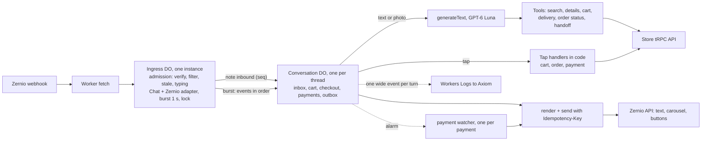

# Plan 029: Messenger bot rewrite on Agents SDK + Chat SDK + Zernio

Status: **draft for review**

Depends on: Zernio transport already live (PR #338, ADR 0011)
Replaces: the customer half of `apps/agent` (Flue). The Telegram admin half follows in phase 5.

## Goal

A customer Messenger bot that answers in 4 to 7 seconds with correct products, prices and stock, in the shop's own short Cyrillic voice. The model answers questions. Code handles every button tap, every order and every payment. No double carousels, no model-placed orders, no answers landing after the customer already moved on.

## What the real chats say

Source: the page's Facebook export (`vit-playground/facebook-100057596651892-2026-05-13-*`, 1,697 conversations, 34,494 messages, April to mid-May 2026). Analysis scripts live in `~/dev/scratchpad/vit-store/convo-analysis/`.

| Finding                                 | Number                                                              | Design consequence                                                |
| --------------------------------------- | ------------------------------------------------------------------- | ----------------------------------------------------------------- |
| Customer messages per day               | ~330                                                                | One Ingress Durable Object is enough                              |
| Customer text in Latin-script Mongolian | 70% (26% Cyrillic)                                                  | The prompt carries a Latin-script glossary                        |
| Admin text in Latin script              | 91%, median 15 chars                                                | The bot answers in Cyrillic anyway: models write it better        |
| Turns split into several messages       | 50%                                                                 | Burst merging plus queueing in Chat SDK                           |
| Gap between parts of a split turn       | median 12 s, 6% under 2 s                                           | A 2 s burst window catches few. The rest queue into the next turn |
| Turns with a photo                      | 22% (1,718 product photos, 570 payment screenshots)                 | Images go straight to the model                                   |
| Human admin reply time                  | median 2.6 min, p90 55 min                                          | 4 to 7 s is a large improvement even with imperfect merging       |
| Most asked products                     | magnesium 351, vitamin D 256, omega 202, kids 181, zinc 150, K2 142 | Search must handle dose, pack size, pouch vs bottle               |
| Conversations started from an ad        | 34% (22% from a post)                                               | Log `ad_id` per turn                                              |
| Messages with a phone number            | 822, 98% plain 8 digits, 50% phone-only, 36% with address           | Phone and address often arrive in separate turns                  |
| Expiry questions                        | 134 messages in 113 conversations                                   | Expose `expirationDate` to the bot                                |
| Long admin replies (>=200 chars)        | 75, confirmed ChatGPT pastes                                        | Excluded from voice examples                                      |

## Decisions

| Area                   | Decision                                                                                                                                                                                                                                                                            |
| ---------------------- | ----------------------------------------------------------------------------------------------------------------------------------------------------------------------------------------------------------------------------------------------------------------------------------- |
| Stack                  | Plain `Agent` (agents SDK) + Chat SDK (`chat`) + `@zernio/chat-sdk-adapter` + AI SDK. No Think, no Flue.                                                                                                                                                                            |
| Why not Think          | Taps must stay in code, in order, inside the SDK lock. Think's messenger path turns taps into model turns and converts photos into a text line.                                                                                                                                     |
| Durable Objects        | One `Ingress` DO runs the Chat SDK runtime. One top-level `Conversation` DO per thread, addressed with `getAgentByName(env.Conversation, threadId)`. No facets: `subAgent` is deprecated in agents 0.24 and independent chats should not share one machine's failure domain.        |
| Admission              | `Ingress.onRequest` verifies and parses the Zernio envelope itself before Chat SDK sees it: only incoming Facebook `message.received` for configured accounts, 3-minute stale check on the envelope timestamp, typing starts here, the event is recorded in the Conversation inbox. |
| Model                  | GPT-6 Luna, reasoning off, through `@ai-sdk/openai` with `baseURL` from env. Local tests use CLIProxyAPI. Production uses AI Gateway credits or an OpenAI key. Never the personal subscription in production.                                                                       |
| Voice                  | Warm but short, Cyrillic. 1 to 2 lines for logistics, 2 to 3 lines for advice, 300 characters max, at most one emoji, no markdown, no warnings, never a total or price the tools did not return.                                                                                    |
| Prompt shape           | One longer system prompt, cached. No skills: on-demand loading adds a model round trip per use.                                                                                                                                                                                     |
| Merging split messages | Burst window 1 s, plus supersede: a model reply is dropped if a newer inbound message for the thread arrived while it was being generated. The next turn answers everything.                                                                                                        |
| Payment                | Upfront. QPay or bank transfer. Khaan reconciler confirms transfers, restarted on customer claims.                                                                                                                                                                                  |
| Delivery zone          | Not asked. Admin sets it in the dashboard. `addressZoneId` is optional in `newOrderSchema`.                                                                                                                                                                                         |
| Order placement        | A ✅ postback button carrying the checkout revision. Code calls `order.addOrder` at most once per revision.                                                                                                                                                                         |
| Phone and address      | Model extracts them in the same turn via `set_delivery`, code validates, the ✅ summary is the final check.                                                                                                                                                                         |
| Photos                 | Image bytes in the user message. No R2, no separate vision call.                                                                                                                                                                                                                    |
| Sends                  | One small Zernio send function with an `Idempotency-Key` per message part, so recovery never posts twice.                                                                                                                                                                           |
| Telegram admin bot     | Phase 5, same worker, Chat SDK Telegram adapter. `apps/agent` stays for Telegram until then.                                                                                                                                                                                        |

## Architecture



Ingress only admits, batches and forwards. Every piece of conversation state, every send and every payment watcher lives in the thread's own `Conversation` DO, so one busy or broken thread cannot stall another. Ingress keeps a small `threads(thread_id, last_at)` table as the index for the admin route.

## Files

```text
apps/messenger/
|-- wrangler.jsonc          # Ingress DO binding, model env, Axiom log destination
`-- src/
    |-- index.ts            # Worker fetch: /zernio/webhook, /admin/* (token)
    |-- ingress.ts          # Agent: Chat SDK runtime, burst handler, tap router
    |-- conversation.ts     # Agent: SQLite, respond(), handleTap(), checkPayment()
    |-- tools.ts            # AI SDK tools: read or set state, never send
    |-- render.ts           # reply object to Zernio text, carousel, buttons
    |-- prompt.ts           # voice, glossary, shop facts, per-turn state note
    |-- store.ts            # typed tRPC client for the store API
    `-- log.ts              # one wide event per turn
packages/assistant/         # reused: cart reducer, formatting, payment payloads
apps/agent/                 # Telegram admin only until phase 5
```

## Call stacks

Text or photo:

```text
Worker.fetch POST /zernio/webhook
  Ingress.onRequest
    admit(rawBody)                                  # our check, before Chat SDK
      verify X-Zernio-Signature, parse envelope { id, timestamp, account, message, metadata }
      drop: not message.received, not incoming, not facebook, unknown account, older than 3 min
      conversation = getAgentByName(env.Conversation, threadId)
      conversation.noteInbound({ eventId, seq })    # inbox row "pending", bumps latest_seq
      startTyping(conversationId)                   # before the burst wait
    bot.webhooks.zernio(request, { waitUntil })     # Chat SDK: dedupe, lock, burst 1 s
      Ingress.onBurst(thread, [...skipped, message])
        conversation.process(events in arrival order)
          if paused: mark done, return
          for each event in order
            tap      -> handleTap(tap)              # code, see below
            text     -> collect into one model turn
          respond(collected)
            startSeq = latest_seq
            generateText(system, history by whole turns, stateNote, text + image parts)
              step 1  search_products({ query: "kids vitamin d3" })   # results carry a label summary
              step 2  reply({ text, productIds })                     # execute returns the payload
            if latest_seq > startSeq: drop the draft, log "superseded"
            else render(reply): text, then one carousel (max 10 cards)
          mark inbox rows done
```

Card tap:

```text
handleTap({ kind: "add", productId })     # payload from metadata.postbackPayload or quickReplyPayload
  cart reducer with name and price snapshot, no model call
  bump checkout revision
  render  cart summary + quick replies ➕ ➖ ✖ ✅
```

Checkout, order, payment:

```text
Customer: "Сүхбаатар дүүрэг 11р хороо 722р байр 88 тоот 9911 2233, ирэхдээ залгаарай"
  respond
    set_delivery({ phone, address, note })
      normalize phone (strip spaces, dashes, +976), require ^[6-9]\d{7}$
      phone digits must appear in the customer's messages
      address must come from the customer's text (digit groups and most words present)
      merge with saved state, bump checkout revision, return { saved, missing }
    reply({ text: "За.", action: "confirm_order" })
  render  fixed summary from fresh catalog prices + 6,000₮   [✅ Захиалах  payload order_confirm:<rev>]

✅ tap  handleTap({ kind: "order_confirm", rev })
  rev != current revision            -> "Сагс өөрчлөгдсөн" + new summary, no order
  an order already exists for rev    -> re-render that order's payment buttons, no new order
  else store.order.addOrder({ phoneNumber, address, notes, products })
         save order + payment row: orderNumber, paymentNumber, checkoutToken, account, total
         start payment watcher (one per payment, persisted deadline)
         render fixed "Захиалга авлаа · Нийт <total from API>"
                + [QPay: buildQpayPageUrl(store, { paymentNumber, checkoutToken })] [Дансаар шилжүүлэх]

Дансаар шилжүүлэх tap
  store.payment.selectTransfer({ paymentNumber, checkoutToken })   # starts the 5-minute reconciler
  render account name and number returned by addOrder, the API total, reference = customer phone

"хийсэн" or a screenshot after bank details
  store.payment.claimTransferPaid
  store.payment.selectTransfer again                               # restarts reconciliation if it ended
  short ack "Шалгаад баталгаажуулна"

payment watcher alarm, every 60 s until the deadline (2 h)
  store.payment.getPaymentStatus({ paymentNumber, checkoutToken })
  success  -> send "Төлбөр баталгаажлаа." once (payments.notified), stop
  reconciler ended unmatched and the customer claimed -> handoff to admin
  deadline -> stop silently, admin sees the unpaid order in the dashboard
```

## Code shapes

Target shapes. API names checked against `chat@4.41.1`, `@zernio/chat-sdk-adapter@0.5.1`, `agents@0.24`, AI SDK 6, and re-checked by the review below.

```ts
export { ChatSdkStateAgent } from "agents/chat-sdk";

export class Ingress extends Agent<Env> {
	bot!: Chat;

	onStart() {
		const zernio = createZernioAdapter({
			apiKey: this.env.ZERNIO_API_KEY,
			webhookSecret: this.env.ZERNIO_WEBHOOK_SECRET,
			botName: "Америк Витамин",
		});
		this.bot = new Chat({
			userName: "amerik-vitamin",
			adapters: { zernio },
			state: createChatSdkState(),
			concurrency: {
				strategy: "burst",
				debounceMs: 1000,
				maxQueueSize: 30,
				onQueueFull: "drop-newest",
			},
		});
		this.bot.onDirectMessage(async (thread, message, _channel, ctx) => {
			const conversation = await getAgentByName(this.env.Conversation, thread.id);
			await conversation.process([...(ctx?.skipped ?? []), message].map(toEvent));
		});
	}

	async onRequest(request: Request) {
		const admitted = await admit(this.env, await request.clone().text(), request.headers);
		if (!admitted.ok) return new Response("ok");
		return this.bot.webhooks.zernio(request, { waitUntil: (p) => this.ctx.waitUntil(p) });
	}
}
```

```ts
async respond(inputs: TurnInput[]) {
  const startSeq = this.latestSeq();
  const result = await generateText({
    model: luna(this.env),
    system: SYSTEM_PROMPT,
    messages: [...this.historyByTurns(20), stateNote(this), ...toModelMessages(inputs)],
    tools: customerTools(this),
    stopWhen: [hasToolCall("reply"), stepCountIs(5)],
    providerOptions: { openai: { reasoningEffort: "none" } },
  });
  const reply = replyFrom(result) ?? FALLBACK_REPLY;      // no reply call -> "Шалгаад хэлье" + handoff flag
  this.saveTurn(inputs, result.response.messages);         // tool calls and results stay paired
  if (this.latestSeq() > startSeq) return { superseded: true };
  return reply;
}
```

```ts
reply: tool({
  description: "Your answer to the customer. Call exactly once, last. Never write totals.",
  inputSchema: valibotSchema(v.object({
    text: v.pipe(v.string(), v.maxLength(300)),
    productIds: v.optional(v.pipe(v.array(v.number()), v.maxLength(10))),
    action: v.optional(v.picklist(["show_cart", "confirm_order"])),
  })),
  execute: async (payload) => payload,   // a real result, so saved history replays cleanly
}),
```

`render` sends every part through one `send(conversationId, body, key)` that sets `Idempotency-Key` to `<turnId>:<part>`. It covers text, the 10-card generic template and quick replies. The adapter's Card mapping produces one card element and no quick replies, so raw bodies are needed anyway.

## Who handles what

| Situation                                                                                       | Owner        | Detail                                                                                                          |
| ----------------------------------------------------------------------------------------------- | ------------ | --------------------------------------------------------------------------------------------------------------- |
| Product question, photo, advice, comparison                                                     | model        | `search_products` (with label summary), `product_details` only for dose, ingredients, comparisons, then `reply` |
| "2 ширхэг авъя", "uuttai"                                                                       | model        | `cart_set`, then `reply` with `action: "show_cart"`                                                             |
| Address and phone in free text                                                                  | model + code | `set_delivery`, validated in code, then `reply` with `action: "confirm_order"`                                  |
| "Where is my order"                                                                             | model        | `order_status` reads this conversation's last order                                                             |
| Didn't arrive, wrong or damaged item, change or cancel, customs, complaints, "are you a person" | model        | `handoff`: bot pauses for the thread, Telegram alert to admins                                                  |
| Захиалах on a card, cart quick replies                                                          | code         | cart reducer, summary                                                                                           |
| ✅ Захиалах                                                                                     | code         | `order.addOrder`, fixed confirmation, payment buttons                                                           |
| Дансаар шилжүүлэх                                                                               | code         | `payment.selectTransfer`, bank details, payment watcher                                                         |
| "хийсэн" or a screenshot after bank details                                                     | code         | `payment.claimTransferPaid`                                                                                     |
| Payment confirmed                                                                               | code         | watcher sends the confirmation                                                                                  |

## Prompt

Version 2 was tested with live catalog search on 11 real advice questions: every question got a useful answer at 4 to 6 s (one photo turn 10.9 s), against 6 of 11 "Шалгаад хэлье" with the terse voice.

```text
Чи Америк Витамин дэлгүүрийн Messenger админ. Найрсаг, дулаахан, гэхдээ товч бич.

ХЭЛ: Кирилл монголоор хариул. Харилцагчид ихэвчлэн латинаар бичдэг. Үг: tsair=цайр (zinc),
tumur=төмөр (iron), kaltsi=кальци, magni=магни, zagasnii tos=загасны тос (omega-3),
ashigtai bakter=пробиотик, hvvhed/huuhed=хүүхэд, savtai=савтай, uuttai=ууттай,
bga uu/bnu=байгаа юу, hed ve=хэд вэ, yund=юунд, 5000tai d=D3 5000 IU.

ХЭВ МАЯГ:
- Хүргэлт, үнэ, байгаа эсэх: 1-2 богино мөр.
- Юунд сайн, яаж уух, аль нь дээр: 2-3 богино мөр. Гол ач тус, яаж уух, хэрэгтэй бол нэг асуулт.
- 300 тэмдэгтээс бүү хэтрүүл. Emoji хамгийн ихдээ 1. Markdown бүү ашигла.
- Анхааруулга, "эмчтэйгээ зөвлөлдөөрэй" бүү бич. D3 5000-10000 IU энгийн.
- Бараа өвчин эдгээнэ гэж бүү хэл, "дэмждэг", "тусалдаг" гэж хэл.

ХАЙЛТ: бичсэн асуултад 1-3 англи үг ("zinc", "women probiotic"). Зурагт брэнд + нэр.
Хоосон бол энгийн үгээр нэг дахин хай. Тохирох бараа олдвол productIds-д заавал оруул.

МЭДЛЭГ: Үнэ, үлдэгдэл, хүргэлтийг зөвхөн багажаас болон доорх мэдээллээс хэл. Орцын ерөнхий
ач тус, түгээмэл хэрэглээг өөрийн мэдлэгээр товч хариулж болно. "Шалгаад хэлье" зөвхөн манай
дэлгүүрийн мэдээлэл олдохгүй үед.

ДЭЛГҮҮРИЙН МЭДЭЭЛЭЛ:
- Хүргэлт Улаанбаатарт 6,000₮. 11 цагаас өмнө өгсөн захиалга өнөөдөртөө, 11 цагаас хойшхи захиалга маргааш хүргэгдэнэ.
- Орон нутаг руу Замын Унаа эсвэл хот хоорондын таксиар явуулна, тээврийн зардлыг хүлээн авагч төлнө.
- Очиж авах боломжгүй, зөвхөн хүргэлтээр.
- Төлбөрийг хүргэлтээс өмнө QPay эсвэл дансаар төлнө. StorePay байхгүй.
- Буцаалт, мөнгө буцаан олголт байхгүй. Төлсний дараа цуцлахгүй.
- Хямдрал, урамшуулал байхгүй.
- Каталогид байхгүй барааг захиалгаар авчирдаггүй.
- Утасны дугаар, хүргэгчийн дугаар өгөхгүй. Асуувал энд бичихийг хүс.
- Бүх бараа АНУ-аас шууд ирсэн жинхэнэ бараа.
- Дууссан бараа ихэвчлэн 7-14 хоногт дахин ирдэг. Яг огноо мэдэхгүй бол "Шалгаад хэлье".
- Барааны карт тусдаа гардаг тул жагсаалтыг текстэнд давтахгүй. Хариулт бүрийг reply-аар илгээ.

Жишээ:
Х: Ene yund uudag ve (beta glucan) → А: Дархлааг дэмждэг бета-глюкан байгаа 😊 Өдөрт 2 капсул ууна.
Х: 600g ni heden sariin hereglee bol? → А: Өдөрт 1 халбагаар 4 сар орчим хүрнэ.
```

Per-turn state note, sent after history so the static prompt stays cached: current Ulaanbaatar time and weekday, cart lines, saved phone, address and note, last order number and payment status, `ad_id`, `bot_paused_until`.

## Storage per Conversation

```sql
CREATE TABLE inbox    (event_id TEXT PRIMARY KEY, seq INTEGER, payload TEXT, status TEXT, at INTEGER); -- pending | done
CREATE TABLE messages (id TEXT PRIMARY KEY, turn_id TEXT, role TEXT, content TEXT, created_at INTEGER);
CREATE TABLE cart     (product_id INTEGER PRIMARY KEY, qty INTEGER NOT NULL, name TEXT, price INTEGER);
CREATE TABLE checkout (id INTEGER PRIMARY KEY CHECK (id = 1), revision INTEGER NOT NULL DEFAULT 0,
                       phone TEXT, address TEXT, note TEXT);
CREATE TABLE payments (payment_number TEXT PRIMARY KEY, order_number TEXT, revision INTEGER UNIQUE,
                       checkout_token TEXT, account_name TEXT, account_number TEXT, total INTEGER,
                       status TEXT, claimed INTEGER, deadline INTEGER, notified INTEGER);
CREATE TABLE outbox   (key TEXT PRIMARY KEY, sent_at INTEGER);
CREATE TABLE meta     (key TEXT PRIMARY KEY, value TEXT);  -- latest_seq, ad_id, paused_until
```

Replaces `MessengerAdmissionStore`, `CartStore`, `CheckoutStore` and Flue's agent DO. Images stay in history for the last few turns, then become a text placeholder. A token-protected `/admin/conversations` route lists threads and reads transcripts.

## Durability and ordering

- Chat SDK writes its dedupe key before the handler runs and removes queue entries before handlers finish, so a crash mid-turn would lose the message. The `inbox` table closes that gap: admission records the event as `pending` before Chat SDK sees it, `process` marks it `done` after the reply is sent. On `onStart` and on a 1-minute alarm, pending rows younger than 10 minutes are processed again.
- Re-processing is safe because every send carries an idempotency key and every send is recorded in `outbox`. A resumed turn re-runs the model but never re-posts a part that already went out.
- Events inside one burst are processed in arrival order. An address correction followed by ✅ applies the correction first.
- Taps are cheap and must not be dropped: queue size 30, `drop-newest`, so a flood of text cannot evict a ✅ tap.
- Watcher sends, tap renders and model renders all run inside the Conversation DO, one at a time.

## Handoff and pause

- `handoff({ reason })` sets `paused_until = now + 12 h`, sends the customer one fixed line ("Админ удахгүй хариулна"), and posts an alert to the admin Telegram chat with the thread link, reason and last messages.
- While paused, `process` marks events done without a model turn or tap handling. Payment confirmations still go out.
- Resume: an inline "▶ Бот үргэлжлүүлэх" button on the Telegram alert, plus `POST /admin/conversations/:id/resume`. Both clear `paused_until`.

## Store API change

- Add `expirationDate` to the product query projections behind `product.searchProductsForAssistant` and `product.getProductsByIdsForAdvice` (column `products.expiration_date` exists, the query layer in `packages/api/src/queries/products/store.ts` must select it).
- Assistant search returns only id, name, brand, price, image, slug, stock. The bot's `search_products` tool batch-fetches `getProductsByIdsForAdvice` for the hits and returns a 160-character label summary, `amount`, `dailyIntake` and expiry with each result. No API change needed for that part; it is two parallel store calls inside one tool call.

## Observability

One wide event per turn to Workers Logs, forwarded to Axiom through the `axiom-logs` destination the server already uses:

```json
{
	"event": "turn",
	"conversation": "zernio:…",
	"inputs": 2,
	"photos": 1,
	"model": "gpt-6-luna",
	"steps": 2,
	"tools": ["search_products"],
	"step_ms": [1450, 1620],
	"total_ms": 3890,
	"tokens_in": 7210,
	"tokens_cached": 6100,
	"tokens_out": 96,
	"product_ids": [7473],
	"action": null,
	"ad_id": "120214…",
	"outcome": "replied"
}
```

## Speed budget

| Step                                    | Time                                                           |
| --------------------------------------- | -------------------------------------------------------------- |
| Admission and typing                    | under 0.3 s, typing visible right away                         |
| Burst wait                              | 1.0 s                                                          |
| Model step 1, tool call                 | 1.5 to 2.5 s                                                   |
| Store search + advice batch             | 0.3 to 0.9 s                                                   |
| Model step 2, reply                     | 1.5 to 2.5 s (FAQ answers skip step 1)                         |
| Zernio sends                            | 0.3 to 0.6 s                                                   |
| Total after the customer's last message | about 5 to 8 s for product questions, 3 to 4 s for FAQ answers |

Cached-token numbers are a goal, not a guarantee: rolling history and image placeholders change the reusable prefix. Measure webhook-to-last-send on the production model route, cold and warm, in phase 1.

## Rollout

1. **Test deploy.** `apps/messenger` on its own hostname with Ingress, Conversation, `search_products`, `reply`, render. NatureBell Zernio webhook pointed at it. Gate: every open check below passes on real DMs.
2. **Full build.** All tools, tap handlers, checkout and `set_delivery` checks, payment watcher, handoff with Telegram alert, wide events, admin transcript route, `expirationDate` in the store API.
3. **Accuracy run.** Test set from the export: about 150 Latin-script product questions where the admin's next reply names the product or price, 40 photo turns, the FAQ themes above, 30 address and phone messages. Runs against the real store search, model through CLIProxyAPI. ChatGPT pastes excluded from voice checks. Gate: right product in most cases, median under 7 s, no invented prices, stock or policies.
4. **Switch over.** NatureBell first, then connect the main page to Zernio. At about 400 bot messages a day the main page exceeds Zernio's free 10,000 messages a month and needs the paid plan.
5. **Telegram admin.** Port the admin bot onto the same worker with the Chat SDK Telegram adapter, then delete `apps/agent` and Flue.

Not in v1: back-in-stock alerts, pausing the bot when staff reply in the Zernio inbox, saving `ad_id` on orders (logged only).

## Open checks for the test deploy

| Check                          | Why open                                                                                               | Fallback                                                     |
| ------------------------------ | ------------------------------------------------------------------------------------------------------ | ------------------------------------------------------------ |
| Zernio adapter runs on Workers | imports Node `crypto`                                                                                  | `nodejs_compat`, else HMAC is already checked in `admit`     |
| Tap payloads                   | adapter keeps `metadata` on `message.raw`; check both `postbackPayload` and `quickReplyPayload` arrive | parse taps from the envelope in `admit`                      |
| Burst + supersede              | untested inside a Durable Object                                                                       | tune `debounceMs`, or drop burst and rely on supersede alone |
| Photos reach Luna              | Meta CDN URLs are signed and expire                                                                    | fetch bytes, send a data URL                                 |
| Production model route         | `workers-ai-provider` with `openai/gpt-6-luna`, tools and images unverified                            | `@ai-sdk/openai` with an AI Gateway or OpenAI `baseURL`      |
| Reconciler restart on claim    | `selectTransfer` restarts the 5-minute window only when the previous run is terminal                   | call it again after the window, hand off if still unmatched  |
| Checkout token lifetime        | tokens expire after 7 days                                                                             | order status after that goes to handoff                      |
| `set_delivery` address check   | customers' text gets retyped by the model                                                              | digit groups and most words, not an exact substring          |

## Resolved questions

- Delivery: orders placed before 11:00 are delivered the same day, orders after 11:00 the next day. The per-turn state note carries the current Ulaanbaatar time so the model can say which applies.
- Bank account: the bot shows the account `addOrder` returns, which comes from the server's `KHAAN_ACCOUNT_NAME` and `KHAAN_ACCOUNT_NUMBER` env vars. The same account the reconciler checks.

## Review log

Reviewed by Codex GPT-6 Astra (high reasoning) on 2026-10-01. All 16 findings accepted. Spot-checked: reconciler `MAX_POLL_MS = 5 min` and restart-when-terminal (`apps/server/src/durable-objects/transfer-reconciliation-object.ts`), `addOrder` returning account details and total (`packages/api/src/routers/store/order.ts`), 7-day checkout token TTL (`packages/api/src/lib/session/checkout-access.ts`), `subAgent` deprecated in agents 0.24.

| #   | Finding                                              | Change in this plan                                                                 |
| --- | ---------------------------------------------------- | ----------------------------------------------------------------------------------- |
| 1   | Accepted webhooks lost on eviction                   | `inbox` table, resume pending rows, idempotent sends                                |
| 2   | `order_confirm` not idempotent                       | checkout revision in the payload, one order per revision                            |
| 3   | `reply` without `execute` breaks history             | `execute` returns the payload, history saved by whole turns, fallback when no reply |
| 4   | Reconciler only polls 5 minutes                      | restart on claim, watcher checks reconciler state, handoff when unmatched           |
| 5   | Event id and timestamp dropped by the adapter        | own admission parses the envelope first                                             |
| 6   | Adapter also forwards comments                       | admission filter: incoming Facebook DMs for configured accounts only                |
| 7   | No QPay URL from `addOrder`, token needed everywhere | `buildQpayPageUrl`, token stored per payment and passed on every call               |
| 8   | Watcher only on transfer tap, duplicates possible    | one persisted watcher per payment from order creation, `notified` flag              |
| 9   | Bank details from constants can drift                | render the account returned by `addOrder`                                           |
| 10  | Search has no summary or `dailyIntake`               | tool batch-fetches advice details, expiry added in the query layer                  |
| 11  | Taps reordered, queue can drop them                  | arrival order, queue 30 with `drop-newest`, supersede by sequence                   |
| 12  | Pause not enforced in code                           | `paused_until` gate in `process`, Telegram resume button, admin route               |
| 13  | Cart lacks price snapshots, totals can differ        | snapshots in `cart`, summary from fresh prices, order shows the API total           |
| 14  | Speed table wrong, typing too late                   | typing at admission, burst 1 s, honest 5 to 8 s                                     |
| 15  | Streaming argument against Think was wrong           | removed                                                                             |
| 16  | Facets unneeded, `subAgent` deprecated               | top-level `Conversation` DO per thread                                              |
