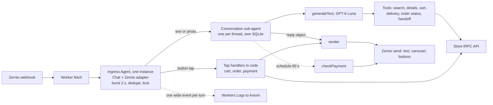

# Plan 029: Messenger bot rewrite on Agents SDK + Chat SDK + Zernio

Status: **draft for review**

Depends on: Zernio transport already live (PR #338, ADR 0011)
Replaces: the customer half of `apps/agent` (Flue). The Telegram admin half follows in phase 5.

## Goal

A customer Messenger bot that answers in 4 to 7 seconds with correct products, prices and stock, in the shop's own short Cyrillic voice. The model answers questions. Code handles every button tap, every order and every payment. No double carousels, no model-placed orders, no answers landing after the customer already moved on.

## What the real chats say

Source: the page's Facebook export (`vit-playground/facebook-100057596651892-2026-05-13-*`, 1,697 conversations, 34,494 messages, April to mid-May 2026). Analysis scripts live in `~/dev/scratchpad/vit-store/convo-analysis/`.

| Finding                                 | Number                                                              | Design consequence                                                |
| --------------------------------------- | ------------------------------------------------------------------- | ----------------------------------------------------------------- |
| Customer messages per day               | ~330                                                                | One Ingress Durable Object is enough                              |
| Customer text in Latin-script Mongolian | 70% (26% Cyrillic)                                                  | The prompt carries a Latin-script glossary                        |
| Admin text in Latin script              | 91%, median 15 chars                                                | The bot answers in Cyrillic anyway: models write it better        |
| Turns split into several messages       | 50%                                                                 | Burst merging plus queueing in Chat SDK                           |
| Gap between parts of a split turn       | median 12 s, 6% under 2 s                                           | A 2 s burst window catches few. The rest queue into the next turn |
| Turns with a photo                      | 22% (1,718 product photos, 570 payment screenshots)                 | Images go straight to the model                                   |
| Human admin reply time                  | median 2.6 min, p90 55 min                                          | 4 to 7 s is a large improvement even with imperfect merging       |
| Most asked products                     | magnesium 351, vitamin D 256, omega 202, kids 181, zinc 150, K2 142 | Search must handle dose, pack size, pouch vs bottle               |
| Conversations started from an ad        | 34% (22% from a post)                                               | Log `ad_id` per turn                                              |
| Messages with a phone number            | 822, 98% plain 8 digits, 50% phone-only, 36% with address           | Phone and address often arrive in separate turns                  |
| Expiry questions                        | 134 messages in 113 conversations                                   | Expose `expirationDate` to the bot                                |
| Long admin replies (>=200 chars)        | 75, confirmed ChatGPT pastes                                        | Excluded from voice examples                                      |

## Decisions

| Area               | Decision                                                                                                                                                                                                                   |
| ------------------ | -------------------------------------------------------------------------------------------------------------------------------------------------------------------------------------------------------------------------- |
| Stack              | Plain `Agent` (agents SDK) + Chat SDK (`chat`) + `@zernio/chat-sdk-adapter` + AI SDK. No Think, no Flue.                                                                                                                   |
| Why not Think      | Taps must stay in code. In our own Chat SDK handler they arrive inside the SDK's dedupe and lock. Think's messenger path turns them into model turns, streams text Zernio cannot edit, and converts photos to a text line. |
| Model              | GPT-6 Luna, reasoning off, through `@ai-sdk/openai` with `baseURL` from env. Local tests use CLIProxyAPI. Production uses AI Gateway credits or an OpenAI key. Never the personal subscription in production.              |
| Voice              | Warm but short, Cyrillic. 1 to 2 lines for logistics, 2 to 3 lines for advice, 300 characters max, at most one emoji, no markdown, no warnings.                                                                            |
| Prompt shape       | One longer system prompt, cached. No skills: on-demand loading adds a model round trip per use.                                                                                                                            |
| Payment            | Upfront. QPay or bank transfer. Khaan reconciler confirms transfers.                                                                                                                                                       |
| Delivery zone      | Not asked. Admin sets it in the dashboard. `addressZoneId` is optional in `newOrderSchema`.                                                                                                                                |
| Order placement    | A ✅ postback button. Code calls `order.addOrder`.                                                                                                                                                                         |
| Phone and address  | Model extracts them in the same turn via `set_delivery`, code validates, the ✅ summary is the final check.                                                                                                                |
| Photos             | Image bytes in the user message. No R2, no separate vision call.                                                                                                                                                           |
| Telegram admin bot | Phase 5, same worker, Chat SDK Telegram adapter. `apps/agent` stays for Telegram until then.                                                                                                                               |

## Architecture



Conversations are facets of the Ingress Durable Object: own SQLite each, run in parallel on the same machine. Same shape as Cloudflare's `examples/chat-sdk-messenger`. `listSubAgents(Conversation)` is the conversation index.

## Files

```text
apps/messenger/
|-- wrangler.jsonc          # Ingress DO binding, model env, Axiom log destination
`-- src/
    |-- index.ts            # Worker fetch: /zernio/webhook, /admin/* (token)
    |-- ingress.ts          # Agent: Chat SDK runtime, burst handler, tap router
    |-- conversation.ts     # Agent: SQLite, respond(), handleTap(), checkPayment()
    |-- tools.ts            # AI SDK tools: read or set state, never send
    |-- render.ts           # reply object to Zernio text, carousel, buttons
    |-- prompt.ts           # voice, glossary, shop facts, per-turn state note
    |-- store.ts            # typed tRPC client for the store API
    `-- log.ts              # one wide event per turn
packages/assistant/         # reused: cart reducer, formatting, payment payloads
apps/agent/                 # Telegram admin only until phase 5
```

## Call stacks

Text or photo:

```text
Worker.fetch POST /zernio/webhook
  Ingress.onRequest
    bot.webhooks.zernio(request, { waitUntil })   # HMAC check, 200 at once
      chat.processMessage                         # dedupe:zernio:{messageId}, 10 min
        burst lock, wait 2 s, drain queue
        Ingress.onBurst(thread, [...skipped, message])
          drop messages older than 3 min
          handle taps first (below)
          thread.startTyping()
          subAgent(Conversation, thread.id).respond(inputs)
            generateText(system, history(20), stateNote, text + image parts)
              step 1  search_products({ query: "kids vitamin d3" })   # returns summary too
              step 2  reply({ text, productIds })                     # loop stops
            save messages, log turn
          render(reply)  text, then one carousel (max 10 cards)
```

Card tap:

```text
Ingress.onBurst
  tapOf(message)                     # message.raw.metadata.postbackPayload "order_product:7473"
  Conversation.handleTap({ kind: "add", productId })
    cart reducer, no model call
  render  cart summary + quick replies ➕ ➖ ✖ ✅
```

Checkout, order, payment:

```text
Customer: "Сүхбаатар дүүрэг 11р хороо 722р байр 88 тоот 9911 2233, ирэхдээ залгаарай"
  Conversation.respond
    set_delivery({ phone, address, note })
      normalize phone (strip spaces, dashes, +976), require ^[6-9]\d{7}$
      phone digits must appear in the customer's messages
      address must come from the customer's text (whitespace-normalized match)
      merge with saved state, return { saved, missing }
    reply({ text: "За.", action: "confirm_order" })
  render  "Утас · Хаяг · Тэмдэглэл · Нийт 131,000₮"  [✅ Захиалах]

✅ tap
  Conversation.handleTap({ kind: "order_confirm" })
    store.order.addOrder({ phoneNumber, address, notes, products })   # no zone
    save orderNumber, paymentNumber, checkoutToken
  render  fixed "Захиалга авлаа" + [QPay (url)] [Дансаар шилжүүлэх (postback)]

Дансаар шилжүүлэх tap
  store.payment.selectTransfer        # starts the Khaan reconciler DO
  render bank details from @vit/shared bankTransfer + amount + reference
  this.schedule(60, "checkPayment", { paymentNumber, tries: 0 })

checkPayment, every 60 s for up to 2 h
  store.payment.getPaymentStatus
  success  send "Төлбөр баталгаажлаа."
  else     schedule again
"хийсэн" or a screenshot meanwhile  store.payment.claimTransferPaid, short ack
```

QPay goes through the same watcher: the QPay webhook confirms on the server, `getPaymentStatus` picks it up.

## Code shapes

Target shapes. API names checked against `chat@4.41.1`, `@zernio/chat-sdk-adapter@0.5.1`, `agents@0.24`, AI SDK 6.

```ts
export { ChatSdkStateAgent } from "agents/chat-sdk";

export class Ingress extends Agent<Env> {
	bot!: Chat;
	zernio!: ZernioAdapter;

	onStart() {
		this.zernio = createZernioAdapter({
			apiKey: this.env.ZERNIO_API_KEY,
			webhookSecret: this.env.ZERNIO_WEBHOOK_SECRET,
			botName: "Америк Витамин",
		});
		this.bot = new Chat({
			userName: "amerik-vitamin",
			adapters: { zernio: this.zernio },
			state: createChatSdkState(),
			concurrency: { strategy: "burst", debounceMs: 2000 },
		});
		this.bot.onDirectMessage((thread, message, _channel, ctx) =>
			this.onBurst(thread, [...(ctx?.skipped ?? []), message]),
		);
	}

	onRequest(request: Request) {
		return this.bot.webhooks.zernio(request, { waitUntil: (p) => this.ctx.waitUntil(p) });
	}
}
```

```ts
async respond(inputs: TurnInput[]) {
  const result = await generateText({
    model: luna(this.env),
    system: SYSTEM_PROMPT,
    messages: [...this.history(20), stateNote(this), ...toModelMessages(inputs)],
    tools: customerTools(this),
    stopWhen: [hasToolCall("reply"), stepCountIs(5)],
    providerOptions: { openai: { reasoningEffort: "none" } },
  });
  this.save(inputs, result.response.messages);
  return replyFrom(result);
}
```

```ts
reply: tool({
  description: "Your answer to the customer. Call exactly once, last.",
  inputSchema: valibotSchema(v.object({
    text: v.pipe(v.string(), v.maxLength(300)),
    productIds: v.optional(v.pipe(v.array(v.number()), v.maxLength(10))),
    action: v.optional(v.picklist(["show_cart", "confirm_order"])),
  })),
}),  // no execute: hasToolCall("reply") ends the loop
```

`render` posts text with `thread.post` and sends carousels and quick replies through `ZernioApiClient.sendMessage` with a raw body, because the adapter's Card mapping only produces one card element and no quick replies.

## Who handles what

| Situation                                                                                       | Owner        | Detail                                                                                                          |
| ----------------------------------------------------------------------------------------------- | ------------ | --------------------------------------------------------------------------------------------------------------- |
| Product question, photo, advice, comparison                                                     | model        | `search_products` (with label summary), `product_details` only for dose, ingredients, comparisons, then `reply` |
| "2 ширхэг авъя", "uuttai"                                                                       | model        | `cart_set`, then `reply` with `action: "show_cart"`                                                             |
| Address and phone in free text                                                                  | model + code | `set_delivery`, validated in code, then `reply` with `action: "confirm_order"`                                  |
| "Where is my order"                                                                             | model        | `order_status` reads this conversation's last order                                                             |
| Didn't arrive, wrong or damaged item, change or cancel, customs, complaints, "are you a person" | model        | `handoff`: bot pauses for the thread, Telegram alert to admins                                                  |
| Захиалах on a card, cart quick replies                                                          | code         | cart reducer, summary                                                                                           |
| ✅ Захиалах                                                                                     | code         | `order.addOrder`, fixed confirmation, payment buttons                                                           |
| Дансаар шилжүүлэх                                                                               | code         | `payment.selectTransfer`, bank details, payment watcher                                                         |
| "хийсэн" or a screenshot after bank details                                                     | code         | `payment.claimTransferPaid`                                                                                     |
| Payment confirmed                                                                               | code         | watcher sends the confirmation                                                                                  |

## Prompt

Version 2 was tested with live catalog search on 11 real advice questions: every question got a useful answer at 4 to 6 s (one photo turn 10.9 s), against 6 of 11 "Шалгаад хэлье" with the terse voice.

```text
Чи Америк Витамин дэлгүүрийн Messenger админ. Найрсаг, дулаахан, гэхдээ товч бич.

ХЭЛ: Кирилл монголоор хариул. Харилцагчид ихэвчлэн латинаар бичдэг. Үг: tsair=цайр (zinc),
tumur=төмөр (iron), kaltsi=кальци, magni=магни, zagasnii tos=загасны тос (omega-3),
ashigtai bakter=пробиотик, hvvhed/huuhed=хүүхэд, savtai=савтай, uuttai=ууттай,
bga uu/bnu=байгаа юу, hed ve=хэд вэ, yund=юунд, 5000tai d=D3 5000 IU.

ХЭВ МАЯГ:
- Хүргэлт, үнэ, байгаа эсэх: 1-2 богино мөр.
- Юунд сайн, яаж уух, аль нь дээр: 2-3 богино мөр. Гол ач тус, яаж уух, хэрэгтэй бол нэг асуулт.
- 300 тэмдэгтээс бүү хэтрүүл. Emoji хамгийн ихдээ 1. Markdown бүү ашигла.
- Анхааруулга, "эмчтэйгээ зөвлөлдөөрэй" бүү бич. D3 5000-10000 IU энгийн.
- Бараа өвчин эдгээнэ гэж бүү хэл, "дэмждэг", "тусалдаг" гэж хэл.

ХАЙЛТ: бичсэн асуултад 1-3 англи үг ("zinc", "women probiotic"). Зурагт брэнд + нэр.
Хоосон бол энгийн үгээр нэг дахин хай. Тохирох бараа олдвол productIds-д заавал оруул.

МЭДЛЭГ: Үнэ, үлдэгдэл, хүргэлтийг зөвхөн багажаас болон доорх мэдээллээс хэл. Орцын ерөнхий
ач тус, түгээмэл хэрэглээг өөрийн мэдлэгээр товч хариулж болно. "Шалгаад хэлье" зөвхөн манай
дэлгүүрийн мэдээлэл олдохгүй үед.

ДЭЛГҮҮРИЙН МЭДЭЭЛЭЛ:
- Хүргэлт Улаанбаатарт 6,000₮. Хүргэлт өглөө 11 цагаас өмнө хийгдэнэ.
- Орон нутаг руу Замын Унаа эсвэл хот хоорондын таксиар явуулна, тээврийн зардлыг хүлээн авагч төлнө.
- Очиж авах боломжгүй, зөвхөн хүргэлтээр.
- Төлбөрийг хүргэлтээс өмнө QPay эсвэл дансаар төлнө. StorePay байхгүй.
- Буцаалт, мөнгө буцаан олголт байхгүй. Төлсний дараа цуцлахгүй.
- Хямдрал, урамшуулал байхгүй.
- Каталогид байхгүй барааг захиалгаар авчирдаггүй.
- Утасны дугаар, хүргэгчийн дугаар өгөхгүй. Асуувал энд бичихийг хүс.
- Бүх бараа АНУ-аас шууд ирсэн жинхэнэ бараа.
- Дууссан бараа ихэвчлэн 7-14 хоногт дахин ирдэг. Яг огноо мэдэхгүй бол "Шалгаад хэлье".
- Барааны карт тусдаа гардаг тул жагсаалтыг текстэнд давтахгүй. Хариулт бүрийг reply-аар илгээ.

Жишээ:
Х: Ene yund uudag ve (beta glucan) → А: Дархлааг дэмждэг бета-глюкан байгаа 😊 Өдөрт 2 капсул ууна.
Х: 600g ni heden sariin hereglee bol? → А: Өдөрт 1 халбагаар 4 сар орчим хүрнэ.
```

Per-turn state note, sent after history so the static prompt stays cached: current Ulaanbaatar time and weekday, cart lines, saved phone, address and note, last order number and payment status, `ad_id`, `bot_paused_until`.

## Storage per Conversation

```sql
CREATE TABLE messages (id TEXT PRIMARY KEY, role TEXT, content TEXT, created_at INTEGER);
CREATE TABLE cart     (product_id INTEGER PRIMARY KEY, qty INTEGER NOT NULL);
CREATE TABLE checkout (id INTEGER PRIMARY KEY CHECK (id = 1), phone TEXT, address TEXT, note TEXT,
                       order_number TEXT, payment_number TEXT, checkout_token TEXT, payment_status TEXT);
CREATE TABLE seen     (event_id TEXT PRIMARY KEY, at INTEGER);   -- tap dedupe if Chat SDK ids are unstable
CREATE TABLE meta     (key TEXT PRIMARY KEY, value TEXT);        -- ad_id, paused_until
```

Replaces `MessengerAdmissionStore`, `CartStore`, `CheckoutStore` and Flue's agent DO. Images stay in history for the last few turns, then become a text placeholder. A token-protected `/admin/conversations` route lists threads and reads transcripts.

## Store API change

Add `expirationDate` to the projections of `product.searchProductsForAssistant` and `product.getProductsByIdsForAdvice` (column `products.expiration_date` already exists). `amount` and `dailyIntake` are already returned, so "how many months does it last" needs no API change.

## Observability

One wide event per turn to Workers Logs, forwarded to Axiom through the `axiom-logs` destination the server already uses:

```json
{
	"event": "turn",
	"conversation": "zernio:…",
	"inputs": 2,
	"photos": 1,
	"model": "gpt-6-luna",
	"steps": 2,
	"tools": ["search_products"],
	"step_ms": [1450, 1620],
	"total_ms": 3890,
	"tokens_in": 7210,
	"tokens_cached": 6100,
	"tokens_out": 96,
	"product_ids": [7473],
	"action": null,
	"ad_id": "120214…",
	"outcome": "replied"
}
```

## Speed budget

| Step                                    | Time                                   |
| --------------------------------------- | -------------------------------------- |
| Burst wait                              | 2.0 s                                  |
| Model step 1, tool call                 | 1.5 to 2.5 s                           |
| Store search                            | 0.3 to 0.8 s                           |
| Model step 2, reply                     | 1.5 to 2.5 s (FAQ answers skip step 1) |
| Zernio sends                            | 0.3 to 0.6 s                           |
| Total after the customer's last message | 4 to 7 s, typing visible within 1 s    |

## Rollout

1. **Test deploy.** `apps/messenger` on its own hostname with Ingress, Conversation, `search_products`, `reply`, render. NatureBell Zernio webhook pointed at it. Gate: every open check below passes on real DMs.
2. **Full build.** All tools, tap handlers, checkout and `set_delivery` checks, payment watcher, handoff with Telegram alert, wide events, admin transcript route, `expirationDate` in the store API.
3. **Accuracy run.** Test set from the export: about 150 Latin-script product questions where the admin's next reply names the product or price, 40 photo turns, the FAQ themes above, 30 address and phone messages. Runs against the real store search, model through CLIProxyAPI. ChatGPT pastes excluded from voice checks. Gate: right product in most cases, median under 7 s, no invented prices, stock or policies.
4. **Switch over.** NatureBell first, then connect the main page to Zernio. At about 400 bot messages a day the main page exceeds Zernio's free 10,000 messages a month and needs the paid plan.
5. **Telegram admin.** Port the admin bot onto the same worker with the Chat SDK Telegram adapter, then delete `apps/agent` and Flue.

Not in v1: back-in-stock alerts, pausing the bot when staff reply in the Zernio inbox, saving `ad_id` on orders (logged only).

## Open checks for the test deploy

| Check                                                     | Why open                                                                    | Fallback                                                                  |
| --------------------------------------------------------- | --------------------------------------------------------------------------- | ------------------------------------------------------------------------- |
| Zernio adapter runs on Workers                            | imports Node `crypto`                                                       | `nodejs_compat`, else verify HMAC in the Worker                           |
| Taps carry `raw.metadata.postbackPayload` and a stable id | adapter dedupes on `platformMessageId \|\| id`                              | dedupe taps on the Zernio event id in `seen`                              |
| Burst merges a two-message split                          | untested inside a Durable Object                                            | tune `debounceMs` or use `queue`                                          |
| Photos reach Luna                                         | Meta CDN URLs are signed and expire                                         | fetch bytes in the Worker, send a data URL                                |
| Production model route                                    | `workers-ai-provider` with `openai/gpt-6-luna`, tools and images unverified | `@ai-sdk/openai` with an AI Gateway or OpenAI `baseURL`                   |
| Late Zernio retries                                       | Chat SDK dedupe lasts 10 min, Zernio retries up to 51 h                     | 3-minute stale filter in `onBurst`                                        |
| One Ingress machine for all threads                       | facets share the parent's machine                                           | fine at ~330 messages a day, shard by thread if logs show queueing        |
| `set_delivery` substring check                            | addresses get retyped with small spelling fixes                             | relax to "every digit group and most words appear in the customer's text" |

## Open questions

- Delivery wording: "delivery before 11 am". Is that the same-day cutoff for paid orders, or the time deliveries arrive the next morning?
- Bank account holder name: admins sent `070005005011147435 batdelger haan bank`, `@vit/shared` says `5011147435, Aviddaram Bazarragchaa`. The bot sends whatever `bankTransfer` holds.
